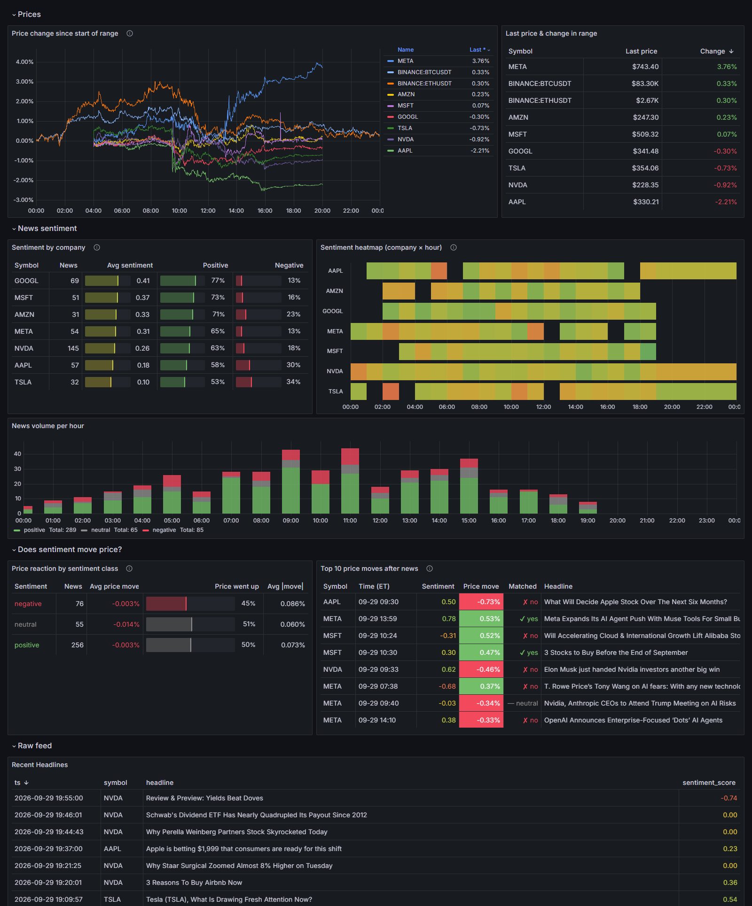

# MarketEcho: Real-Time Sentiment & Price Impact Pipeline

MarketEcho is an end-to-end, event-driven data engineering pipeline that captures financial news, scores sentiment via NLP on the fly, and correlates it with price movements using low-latency stream processing.

The project demonstrates production-grade streaming patterns: out-of-order data handling (watermarks), interval stream joins, market-calendar-aware replay, data quality filtering and idempotent sink design.



*Dashboard for a replayed trading day (29 Sep 2026): price moves, sentiment per company and per hour, and whether sentiment actually moved the price.*

---

## Architecture

```
   Market OPEN (9:30–16:00 ET)          Market CLOSED
   Finnhub WebSocket                    1-min bars for the previous trading day
   (live trades, stocks + crypto)       (Yahoo: stocks 04:00–20:00 ET, Binance: crypto 24h)
                  \                    /
                   v                  v                    Finnhub News API
                 price_producer.py  ──────────────┐        (REST polling every 60s,
                                                   │         same reference day)
                                                   v                 |
                                           [price_ticks]         [news_raw]
                                        Kafka (3 partitions)   Kafka (1 partition)
                                                   |                 |
                                                   +--------+--------+
                                                            |
                                                            v
                                               Apache Flink (PyFlink 1.19)
                                               - VADER sentiment scoring (UDF)
                                               - Watermarks: 1-day out-of-order tolerance
                                               - Interval join: prices in [news_ts - 5min, news_ts + 10min]
                                               - RocksDB state, incremental checkpoints
                                               - At-least-once HTTP sinks (batched for ticks)
                                                            |
                                                            v
                                                       ClickHouse
                                               ReplacingMergeTree (dedup on merge)
                                               TTL 90 days | partitioned by month
                                                            |
                                                            v
                                                         Grafana
```

### Market calendar: one "reference day" for everything

Both producers share [`config/market_calendar.py`](config/market_calendar.py) (NYSE calendar, `America/New_York`):

| Time (ET)                          | Reference day          | Prices                            | News                  |
| ---------------------------------- | ---------------------- | --------------------------------- | --------------------- |
| Trading day, 9:30–16:00            | today                  | live WebSocket trades             | today                 |
| Trading day, after 16:00           | today                  | 1-min bars of today's session     | today                 |
| Before 9:30, weekend, NYSE holiday | previous trading day   | 1-min bars of that day            | that day              |

So when the market is closed, **all** data (including BTC/ETH) describes the last trading day, and `sentiment_impact` can still be computed.

---

## Dashboard

Provisioned automatically from [`grafana/provisioning/dashboards/market-echo.json`](grafana/provisioning/dashboards/market-echo.json):

| Section                   | Panel                                | Answers                                                       |
| ------------------------- | ------------------------------------ | ------------------------------------------------------------- |
| Prices                    | Price change since start of range    | How did each symbol move? (rebased to 0% so BTC and stocks share an axis) |
|                           | Last price & change in range         | Where is each symbol now?                                     |
| News sentiment            | Sentiment by company                 | Who gets good/bad press? (avg score, % positive / negative)   |
|                           | Sentiment heatmap (company × hour)   | When did the tone change, and for whom?                       |
|                           | News volume per hour                 | When does news flow, and how positive is it?                  |
| Does sentiment move price? | Price reaction by sentiment class   | Avg % move and share of "price went up" after positive / neutral / negative news |
|                           | Top 10 price moves after news        | Which headlines preceded the biggest moves, and did the direction match? |
| Raw feed                  | Recent Headlines                     | Latest scored headlines                                        |

Sentiment classes use VADER's standard cut-offs: positive ≥ 0.05, negative ≤ −0.05.

---

## Design Decisions

| Concern                 | Decision                                                                 | Rationale                                                        |
| ----------------------- | ------------------------------------------------------------------------ | ---------------------------------------------------------------- |
| Live prices             | Finnhub WebSocket (free tier)                                            | Real NYSE/NASDAQ + crypto trades, no cost                        |
| Historical prices       | Yahoo chart API (stocks), Binance klines (crypto), 1-min bars, no key    | Finnhub's free tier returns 403 for candles                      |
| News                    | Finnhub REST News API (poll 60s), sent oldest-first                      | Finnhub returns newest-first; unsorted, the watermark dropped ~99% of news as late |
| Market-closed handling  | Replay the previous trading day for prices **and** news                  | Dashboard and join always show a complete, joinable day          |
| Tracked symbols         | AAPL, GOOGL, MSFT, TSLA, AMZN, META, NVDA + BTC/ETH                      | Stocks + 24/7 crypto                                             |
| Watermarks              | 1 day on the join inputs                                                 | Backfilled bars land in Kafka after newer data; the interval join still emits eagerly, the watermark only frees state |
| Flink state backend     | RocksDB, incremental checkpoints                                         | ~1 day of join state stays on disk, not in the 1.7 GB TaskManager heap |
| Data quality            | Drop 1-min bars > 1.5% away from the median of their ±5 neighbours       | Yahoo pre/post-market bars contain isolated bad prints (e.g. −6% for one minute) that fake a news "reaction" |
| Tick sink               | Batched (200 rows) + 5 s timer flush                                     | Avoids tiny ClickHouse parts; timer flushes the tail of a backfill |
| Kafka mode              | KRaft (no ZooKeeper)                                                     | Simpler ops, fewer containers                                    |
| Delivery guarantee      | At-least-once + idempotent sink                                          | Simpler than 2PC exactly-once, same analytical result            |
| ClickHouse engine       | ReplacingMergeTree                                                       | Deduplicates at-least-once retries and replays                   |
| ClickHouse sink         | HTTP API (`requests.post`)                                               | No JDBC JAR needed; works natively with PyFlink                  |
| Data retention          | 90-day TTL (ClickHouse), 7 days (Kafka)                                  | Enough for pattern analysis                                      |
| Restart policy          | `restart: unless-stopped` on core services                               | Stack comes back with Docker Desktop; stop with `stop.bat`       |
| Deployment              | Docker Compose (local)                                                   | Single-command startup, no cloud cost                            |

---

## Tech Stack

| Layer              | Technology                                       |
| ------------------ | ------------------------------------------------ |
| Stream Processing  | Apache Flink 1.19 (PyFlink), RocksDB state       |
| Message Broker     | Apache Kafka 7.6.1 (KRaft mode)                  |
| Analytical Storage | ClickHouse 24.3                                  |
| Price Producer     | Python: websocket-client, requests               |
| News Producer      | Python: requests (REST polling)                  |
| Market calendar    | `holidays` (NYSE), `zoneinfo`                    |
| NLP                | VADER Sentiment (vaderSentiment)                 |
| Visualization      | Grafana 10.4 + ClickHouse datasource plugin      |
| Deployment         | Docker Compose                                   |

---

## Project Structure

```
market-echo-flink-kafka/
├── docker-compose.yml                  # Kafka, Flink, ClickHouse, Grafana, Kafka UI
├── start.bat                           # One-command startup (cmd / PowerShell)
├── stop.bat                            # Teardown
├── requirements.txt                    # Python deps for producers
├── config/
│   ├── settings.example.py             # Template: copy to settings.py (gitignored)
│   └── market_calendar.py              # NYSE calendar, reference_date(), market open/closed
├── kafka/
│   ├── producers/
│   │   ├── price_producer.py           # Live WebSocket or previous-day 1-min bars → price_ticks
│   │   └── news_producer.py            # Finnhub REST polling → news_raw
│   └── consumers/
│       └── consumer.py                 # Debug consumer for verifying Kafka messages
├── flink_jobs/
│   └── sentiment_join.py               # PyFlink: VADER scoring + interval join → ClickHouse
├── clickhouse/
│   └── schema.sql                      # price_ticks, news_events, sentiment_impact tables
├── docker/
│   └── flink/
│       ├── Dockerfile                  # PyFlink image + Kafka connector JAR
│       └── lib/                        # flink-sql-connector-kafka-3.2.0-1.19.jar (download once)
├── grafana/
│   └── provisioning/
│       ├── datasources/clickhouse.yaml # Auto-provisioned ClickHouse datasource
│       └── dashboards/
│           ├── dashboards.yaml         # Dashboard provider
│           └── market-echo.json        # MarketEcho Overview dashboard
└── images/
    └── dashboard.png                   # Screenshot used in this README
```

---

## Quickstart

### Prerequisites
- Docker Desktop running
- Python 3.10+ (`py` on Windows)
- Finnhub free API key: [finnhub.io](https://finnhub.io)

### First-time setup

```bash
# 1. Add your Finnhub key
cp config/settings.example.py config/settings.py
# Edit config/settings.py: set FINNHUB_API_KEY

# 2. Download the Flink Kafka connector JAR (one time only)
curl -L -o docker/flink/lib/flink-sql-connector-kafka-3.2.0-1.19.jar \
  https://repo1.maven.org/maven2/org/apache/flink/flink-sql-connector-kafka/3.2.0-1.19/flink-sql-connector-kafka-3.2.0-1.19.jar

# 3. Install Python dependencies
py -m pip install -r requirements.txt
```

### Start

```powershell
.\start.bat
```

`start.bat` will:
1. Verify Docker is running
2. Start Kafka (KRaft), Flink, ClickHouse, Grafana via Docker Compose
3. Wait for each service to become healthy
4. Launch price and news producers in separate terminal windows
5. Submit the PyFlink sentiment job (skipped if one is already running)
6. Open Grafana at [http://localhost:3000](http://localhost:3000) (admin / admin)

When the market is closed, the price producer prints a per-symbol bar count for the reference day, e.g. `AAPL: 960 bars`, then idles until the next open.

### Stop

```powershell
.\stop.bat
```

> Producers run in their terminal windows: closing them stops the data flow. After a Flink JobManager restart the job must be resubmitted (`start.bat` does this).

---

## Service URLs

| Service         | URL                                                      |
| --------------- | -------------------------------------------------------- |
| Grafana         | [http://localhost:3000](http://localhost:3000)           |
| Flink UI        | [http://localhost:8081](http://localhost:8081)           |
| Kafka UI        | [http://localhost:8080](http://localhost:8080)           |
| ClickHouse HTTP | [http://localhost:8123/play](http://localhost:8123/play) |

---

## ClickHouse Tables

| Table              | Written by                         | Content                                                         |
| ------------------ | ---------------------------------- | --------------------------------------------------------------- |
| `price_ticks`      | Flink `PriceTicksSink` (batched)   | Every live trade or 1-min bar: `symbol, price, volume, ts`      |
| `news_events`      | Flink `NewsEventsSink`             | Every article with its VADER score: `id, symbol, headline, sentiment_score, ts` |
| `sentiment_impact` | Flink interval join                | One row per (news × price tick in −5/+10 min): `symbol, news_ts, sentiment_score, price_ts, price, is_before` |

```sql
-- Is data flowing?
SELECT count(), max(ts) FROM market_echo.price_ticks;
SELECT count(), max(news_ts) FROM market_echo.sentiment_impact;

-- Does sentiment move price? (% move 10 min after vs 5 min before each news item)
WITH per_news AS (
    SELECT symbol, news_ts, any(sentiment_score) AS s,
           (avgIf(price, is_before = 0) / avgIf(price, is_before = 1) - 1) * 100 AS move
    FROM market_echo.sentiment_impact
    GROUP BY symbol, news_ts
    HAVING countIf(is_before = 1) > 0 AND countIf(is_before = 0) > 0
)
SELECT multiIf(s >= 0.05, 'positive', s <= -0.05, 'negative', 'neutral') AS sentiment,
       count()                         AS news,
       round(avg(move), 3)             AS avg_move_pct,
       round(countIf(move > 0) / count() * 100) AS up_share_pct
FROM per_news
GROUP BY sentiment;
```

Note: only news published while prices exist can match. Stocks have bars 04:00–20:00 ET, so overnight articles appear in `news_events` but not in `sentiment_impact`.
